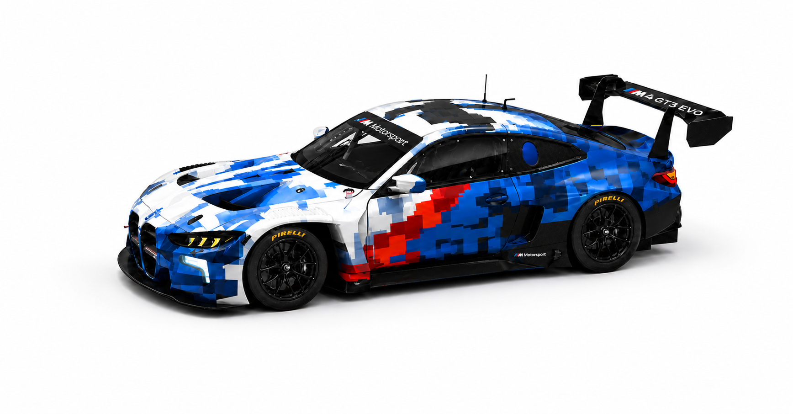

# BMW M4 GT3 EVO — Interactive Showcase

Prototipo de landing interactiva para el BMW M4 GT3 EVO, estilo pit-garage / telemetría industrial.



## La idea

El video de apertura **es** el carro: en el hero está pausado en el primer frame, y el botón
**SPECS** lo reproduce a 3× — el capó y la puerta se abren de verdad — dejando los callouts
de ingeniería (01–05) anclados sobre el motor P58. **CLOSE HOOD** reproduce el video invertido
(generado con AVFoundation), así el cierre también es footage real.

## Interacciones

- **M DRIVELOGIC**: palanca R/N/S — cada marcha sacude la pantalla, hace punch-zoom de toda la
  página hacia el carro y vibra el dispositivo (háptica), con intensidad según la marcha.
- **HOLD TO REV**: mantener presionado revoluciona el motor; la pantalla brilla y se satura en
  rampa hasta el whiteout total → "M POWER UNLEASHED".
- **Control de cámara**: flechas ↑/↓ con 3 encuadres (WIDE / STD / NEAR).
- Cursor custom con lerp, crosshair con coordenadas, celdas de la cuadrícula que se iluminan
  al paso del cursor, telemetría fake en vivo (OIL / WTR / RPM), marquee gigante outline.
- Responsive completo con soporte táctil (palanca, cámara, REV y callouts funcionan con tap).

## Correr localmente

```bash
python3 -m http.server 8844 --directory .
# → http://localhost:8844
```

Sin dependencias ni build: HTML + CSS + JS vanilla.

## Stack visual

Anton · IBM Plex Mono · Archivo · Press Start 2P — tricolor M (#009ADA / #1C69D4 / #E4002B)
sobre papel #FBFBFC.

---

Prototipo de diseño — assets del BMW M4 GT3 EVO propiedad de BMW M Motorsport.
